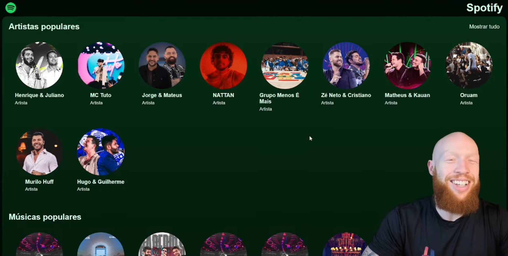

# Jornada Full Stack da Hashtag

## 🚩 Sobre
Nesse projeto criado juntamente com a Hashtag, foi desenvolvido um protótipo do Spotify com uma explicação clara e didática das tecnologias utilizadas. O Diego, professor da Hashtag, apresentou um excelente embasamento e detalhou cada passo do desenvolvimento. Com ele, pude revisar conceitos e aprender novas tecnologias. Agradeço pela imersão e em breve aplicarei essas habilidades em novos projetos.

## 🚀 Tecnologias e ferramentas

1. HTML e CSS
2. JavaScript
3. Vite (build tool)
4. Node.js
5. React
6. Express
7. MongoDB

## 🚨 Aviso

O projeto não é original, foi criado para fins de estudo!